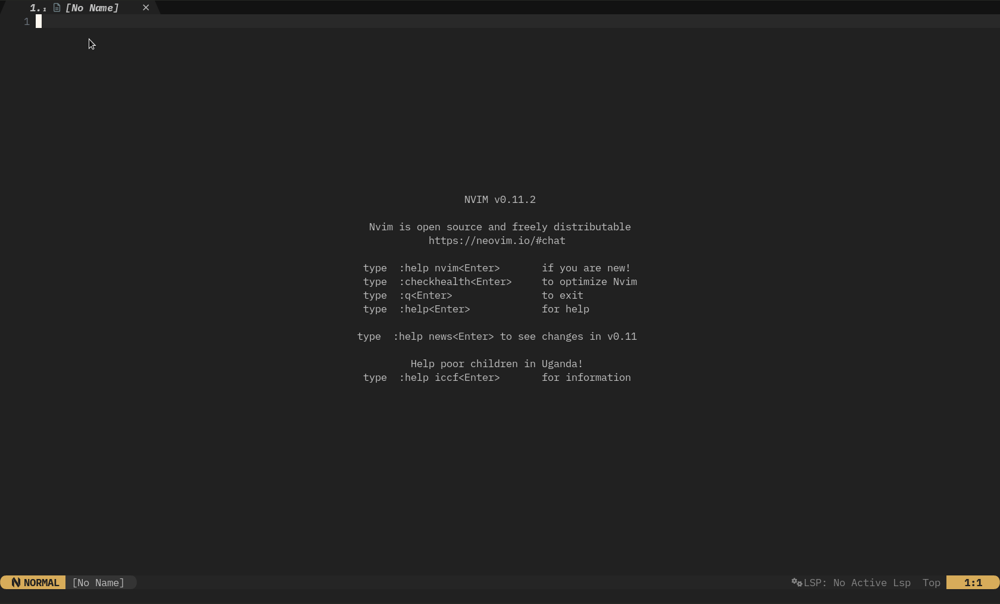

<!--vale off-->
## Rocksmarker project

Benvenuti sulla pagina introduttiva di Rocksmarker, una configurazione personalizzata per Neovim che integra tutte le sue caratteristiche e ne aggiunge molte altre per la gestione dei file, dei repository Git, delle diagnostiche e molto altro. Questa configurazione è stata progettata per fornire un'esperienza di editing di markdown potente e intuitiva.

Rocksmarker è ancora in fase di sviluppo, ma è già utilizzabile quotidianamente per scrivere e modificare documentazione in markdown. Può essere installato in modo sicuro come configurazione predefinita in `~/.config/nvim` o come configurazione secondaria per markdown, se ne hai già una installata per altri scopi.

La configurazione Rocksmarker include l'utilizzo di **rocks.nvim**, un plugin manager che semplifica l'installazione e la gestione di altri plugin. Al suo interno, Rocksmarker include una vasta gamma di plugin che forniscono funzionalità come la gestione dei buffer, la navigazione nei file, l'autocompletamento, la formattazione del codice, la gestione delle versioni Git e molto altro.

Per iniziare, se soddisfatti i requisiti Lua, basta clonare il repository di Rocksmarker nella cartella di configurazione di Neovim:

```bash
git clone https://github.com/ambaradan/rocksmarker.git ~/.config/nvim
```

Successivamente, avviare Neovim e il processo di installazione inizierà automaticamente. Questo processo installerà luarocks e rocks.nvim, quindi sincronizzerà tutti i plugin configurati. Per le istruzioni dettagliate consultare la [pagina dedicata](./install.md).

Se si preferisce utilizzare Rocksmarker come configurazione secondaria per markdown, è possibile clonare il repository in una cartella diversa, ad esempio `~/.config/rocksmarker`, e avviare Neovim con l'opzione **NVIM_APPNAME=rocksmarker nvim**.



## Funzionalità offerte da Rocksmarker

Rocksmarker è una configurazione avanzata per Neovim che offre una vasta gamma di funzionalità per migliorare l'esperienza di editing, in particolare per la scrittura e la modifica di documentazione in markdown. Ecco alcune delle principali funzionalità offerte:

### Editing Markdown Potenziato

- Highlighting della Sintassi: Rocksmarker include un highlighting della sintassi avanzato per il markdown, che rende più facile leggere e scrivere documenti.
- Folding: La funzionalità di folding consente di nascondere o mostrare sezioni di testo, aiutando a mantenere l'organizzazione e la concentrazione durante l'editing.
- Tag Embedding: Supporto per l'embedding di tag e la loro gestione, semplificando l'inserimento di elementi come immagini, link e altro.

### Sistema di Completamento Avanzato

- Auto-completamento: Un sistema di auto-completamento intelligente che suggerisce parole e frasi mentre scrivi, accelerando il processo di scrittura.
- Snippet: Supporto per gli snippet personalizzabili, che permettono di inserire rapidamente blocchi di testo predefiniti, come titoli, liste e altro.

### Strumenti di Navigazione Potenti

- Navigazione tra File: Funzionalità avanzate per navigare tra i file del progetto, inclusa la ricerca di file e la navigazione nella struttura del progetto.
- Buffer e Finestre: Gestione avanzata dei buffer e delle finestre, che consentono di lavorare su più file contemporaneamente in modo efficiente.

### Strumenti di Diagnostica e Debug

- Linting e Formattazione: Integrazione con strumenti di linting e formattazione per aiutare a mantenere il codice pulito e conforme agli standard.
- Diagnostica Avanzata: Supporto per la diagnostica avanzata, che include l'individuazione di errori e avvisi direttamente all'interno dell'editor.

### Integrazione con Git

- Gestione delle Versioni: Integrazione con Git per la gestione delle versioni, che consente di eseguire operazioni come commit, push e pull direttamente da Neovim.
- Diff e Confronto: Funzionalità per confrontare le versioni dei file e visualizzare le differenze, facilitando la revisione e la gestione delle modifiche.

### Personalizzazione e Estensibilità

- Configurazione Personalizzabile: Rocksmarker offre una configurazione altamente personalizzabile, consentendo di adattare l'ambiente di lavoro alle proprie esigenze specifiche.
- Supporto per Plugin: La possibilità di estendere ulteriormente le funzionalità attraverso l'installazione di plugin aggiuntivi, grazie al plugin manager *rocks.nvim*.

### Interfaccia Utente Intuitiva

- Menu dei Comandi: Un menu dei comandi intuitivo che elenca tutte le azioni disponibili, facilitando l'accesso alle funzionalità di Rocksmarker.
- Scorciatoie Tastiera: Un insieme di scorciatoie tastiera predefinite per eseguire azioni comuni rapidamente.

Rocksmarker rappresenta una soluzione completa per chi cerca un ambiente di editing potente e flessibile per la scrittura e la modifica di documentazione in markdown. La sua ampia gamma di funzionalità e la possibilità di personalizzazione lo rendono uno strumento prezioso per gli autori e gli sviluppatori che lavorano con Neovim.  
Buon editing con Rocksmarker!

## Rocks.nvim come gestore dei plugin

Rocksmarker si distingue per l'utilizzo di **rocks.nvim** come gestore dei plugin, una scelta che riflette l'impegno per la semplificazione e l'efficienza nella gestione delle estensioni di Neovim. *Rocks.nvim* è un plugin manager innovativo che si ispira alla filosofia di *LuaRocks*, il gestore dei pacchetti per Lua, adattandola alle esigenze di Neovim.

### Perché rocks.nvim?

La scelta di utilizzare **rocks.nvim** come gestore dei plugin in Rocksmarker è motivata da diverse ragioni:

- **Semplificazione della configurazione**: rocks.nvim adotta un approccio che pone l'onere della configurazione dei plugin sugli sviluppatori, anziché sugli utenti finali. Ciò significa che gli utenti di Rocksmarker possono godere di una configurazione iniziale semplificata, senza dover gestire manualmente le dipendenze e le configurazioni dei plugin.
- **Integrazione con LuaRocks**: Essendo basato su LuaRocks, rocks.nvim può attingere a un vasto repository di pacchetti Lua già testati e mantenuti. Questo garantisce che i plugin gestiti da rocks.nvim siano stabili e compatibili con Neovim.
- **Gestione automatica delle dipendenze**: rocks.nvim gestisce automaticamente le dipendenze dei plugin, assicurando che tutte le librerie e i componenti necessari siano installati e configurati correttamente.

### Come funziona rocks.nvim?

In Rocksmarker, **rocks.nvim** viene utilizzato per gestire l'installazione e la configurazione di tutti i plugin inclusi nella distribuzione. Quando si avvia Neovim con la configurazione di Rocksmarker per la prima volta, *rocks.nvim* viene automaticamente installato e configurato per gestire i plugin specificati nella configurazione.

Il processo di installazione dei plugin avviene in due fasi principali:

- **Installazione di luarocks e rocks.nvim**: Al primo avvio, Rocksmarker verifica se luarocks e rocks.nvim sono già installati. Se non lo sono, provvede alla loro installazione.

- **Sincronizzazione dei plugin**: Una volta installato rocks.nvim, il gestore dei plugin sincronizza automaticamente tutti i plugin elencati nella configurazione di Rocksmarker. Questo include l'installazione di eventuali dipendenze necessarie.

### Vantaggi dell'utilizzo di rocks.nvim

L'utilizzo di *rocks.nvim* in Rocksmarker offre diversi vantaggi, tra cui:

- **Facilità di installazione e gestione dei plugin**: Gli utenti non devono preoccuparsi di installare manualmente i plugin o di gestire le loro dipendenze.
- **Stabilità e compatibilità**: I plugin gestiti da *rocks.nvim* sono garantiti essere stabili e compatibili con Neovim, grazie all'integrazione con LuaRocks.
- **Aggiornamenti semplificati**: *rocks.nvim* semplifica l'aggiornamento dei plugin, assicurando che gli utenti possano sempre usufruire delle ultime funzionalità e correzioni.

In sintesi, l'utilizzo di **rocks.nvim** come gestore dei plugin in Rocksmarker rappresenta una scelta progettuale che valorizza la semplicità, la stabilità e l'efficienza, migliorando significativamente l'esperienza utente nella gestione dei plugin di Neovim.

## Ottimizzazione per il Linguaggio Markdown

Rocksmarker è stato progettato con una particolare attenzione all'ottimizzazione per il linguaggio Markdown. L'obiettivo di Rocksmarker è quello di fornire un ambiente di editing che sia non solo potente e versatile, ma anche altamente specializzato per le esigenze specifiche degli autori che lavorano con Markdown.


### Ottimizzazioni

- **Highlighting della sintassi avanzato**: Rocksmarker include un highlighting della sintassi per Markdown che è stato progettato per essere chiaro e facile da leggere. Questo aiuta gli autori a identificare rapidamente gli elementi di markup e a concentrarsi sulla scrittura.
- **Supporto per le estensioni di Markdown**: Oltre al supporto per la sintassi standard di Markdown, Rocksmarker offre anche il supporto per diverse estensioni comunemente utilizzate, come le tabelle, i task list e le note a piè di pagina. Questo consente agli autori di sfruttare le funzionalità avanzate di Markdown senza dover cambiare ambiente di lavoro.
- **Strumenti di formattazione e linting**: Per aiutare a mantenere la qualità e la consistenza della documentazione, Rocksmarker include strumenti di formattazione e linting specificamente progettati per Markdown. Questi strumenti possono aiutare a identificare e correggere errori di formattazione e a mantenere uno stile coerente.
- **Snippet e auto-completamento per Markdown**: Per accelerare il processo di scrittura, Rocksmarker offre snippet e funzionalità di auto-completamento specificamente progettati per Markdown. Questi includono elementi comuni come titoli, link, immagini e altro, consentendo agli autori di inserire rapidamente i blocchi di testo più utilizzati.
- **Anteprima e rendering**: Sebbene l'anteprima e il rendering di Markdown siano funzionalità avanzate che possono richiedere l'integrazione con strumenti esterni, Rocksmarker è progettato per essere compatibile con diverse soluzioni di anteprima e rendering. Ciò consente agli autori di visualizzare il proprio lavoro in tempo reale e di apportare modifiche immediate.

### Vantaggi dell'ottimizzazione per Markdown

L'ottimizzazione di Rocksmarker per Markdown offre diversi vantaggi significativi agli autori:

- **Maggiore produttività**: Grazie alle funzionalità specializzate per Markdown, gli autori possono lavorare più velocemente e con maggiore efficienza.
- **Migliore qualità della documentazione**: Gli strumenti di formattazione e linting aiutano a mantenere una documentazione di alta qualità, coerente e facile da leggere.
- **Esperienza di scrittura migliorata**: L'ambiente di editing ottimizzato per Markdown fornisce un'esperienza di scrittura più fluida e intuitiva, consentendo agli autori di concentrarsi sulla creazione di contenuti di alta qualità.

## Riconoscimenti

Un grande ringraziamento va agli sviluppatori di NvChad per l'eccellente codice prodotto che è servito come studio e ispirazione per la stesura di questa configurazione. Un ringraziamento va anche agli sviluppatori di *rocks.nvim*, che hanno portato una ventata di aria fresca nella gestione dei plugin di Neovim, e a tutti gli sviluppatori dei plugin utilizzati.
