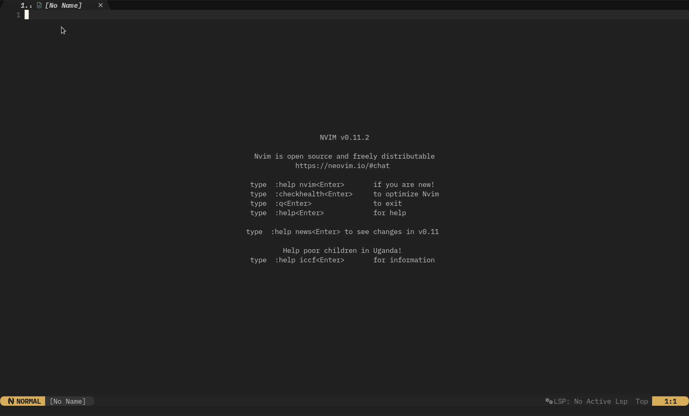
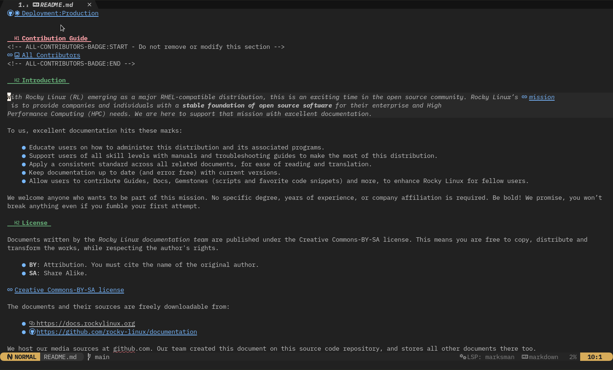

## Rocksmarker project

Welcome to the introductory page for Rocksmarker, a custom configuration for Neovim that integrates all of its features and adds many more for file management, Git repositories, diagnostics, and much more. The design of this configuration is to provide a powerful and intuitive markdown editing experience.

Rocksmarker is still under development, but you can already use it on a daily basis to write and edit markdown documentation. It can be safely installed as the default configuration in `~/.config/nvim` or as a secondary configuration for markdown, if you already have one installed for other purposes.

The Rocksmarker configuration includes the use of **rocks.nvim**, a plugin manager that simplifies the installation and management of other plugins. Rocksmarker includes a wide range of plugins that provide features such as buffer management, file navigation, autocompletion, code formatting, Git version management, and much more.

To get started, if you meet the Lua requirements, simply clone the Rocksmarker repository into your Neovim configuration folder:

```bash
git clone https://github.com/ambaradan/rocksmarker.git ~/.config/nvim
```

Next, launch Neovim and the installation process will start automatically. This process will install **luarocks** and **rocks.nvim**, then synchronize all configured plugins. For detailed instructions, see the [dedicated page](./install.md).

If you prefer to use Rocksmarker as a secondary configuration for markdown, you can clone the repository to a different folder, such as `~/.config/rocksmarker`, and start Neovim with the option **NVIM_APPNAME=rocksmarker nvim**.



## Features offered by Rocksmarker

Rocksmarker is an advanced configuration for Neovim that offers a wide range of features to enhance the editing experience, particularly for writing and editing documentation in markdown. Here are some of the main features it offers:

### Enhanced markdown editing

- Syntax Highlighting: Rocksmarker includes advanced syntax highlighting for Markdown, making it easier to read and write documents.
- Folding: The folding feature allows you to hide or show sections of text, helping you stay organized and focused while editing.
- Tag Embedding: Support for tag embedding and management, simplifying the insertion of elements such as images, links, and more.

### Advanced completion system

- Auto-complete: An intelligent auto-complete system that suggests words and phrases as you type, speeding up the writing process.
- Snippets: Support for customizable snippets, allowing you to quickly insert predefined blocks of text, such as titles, lists, and more.

### Powerful navigation tools

- File Navigation: Advanced features for navigating project files, including file search and project structure navigation.
- Buffers and Windows: Advanced buffer and window management, allowing you to work on multiple files simultaneously in an efficient manner.

### Diagnostic and debugging tools

- Linting and Formatting: Integration with linting and formatting tools to help keep code clean and compliant with standards.
- Advanced Diagnostics: Support for advanced diagnostics, including error detection and warnings directly within the editor.

### Integration with Git

- Version Control: Integration with Git for version control, allowing you to perform operations such as commit, push, and pull directly from Neovim.
- Diff and Compare: Features for comparing file versions and viewing differences, facilitating review and change management.

### Customization and extensibility

- Customizable Configuration: Rocksmarker offers a highly customizable configuration, allowing you to tailor your work environment to your specific needs.
- Plugin Support: The ability to further extend functionality by installing additional plugins, thanks to the *rocks.nvim* plugin manager.

### Intuitive user interface

- Command Menu: An intuitive command menu that lists all available actions, facilitating access to Rocksmarker's features.
- Keyboard Shortcuts: A set of predefined keyboard shortcuts for quickly performing common actions.

Rocksmarker is a comprehensive solution for those looking for a powerful and flexible editing environment for writing and editing markdown documentation. Its wide range of features and customization options make it a valuable tool for authors and developers working with Neovim.  
Happy editing with Rocksmarker!

## Rocks.nvim as plugin manager

Rocksmarker stands out for its use of **rocks.nvim** as a plugin manager, a choice that reflects its commitment to simplification and efficiency in managing Neovim extensions. *Rocks.nvim* is an innovative plugin manager inspired by the philosophy of *LuaRocks*, the package manager for Lua, adapting it to the needs of Neovim.

### Why rocks.nvim?

There are several reasons for choosing to use **rocks.nvim** as the plugin manager in Rocksmarker:

- **Simplified configuration**: rocks.nvim takes an approach that places the responsibility for plugin configuration on developers rather than users. This means that Rocksmarker users can enjoy simplified initial configuration without having to manually manage plugin dependencies and configurations.
- **Integration with LuaRocks**: Being based on LuaRocks, rocks.nvim can draw on a vast repository of already tested and maintained Lua packages. This ensures that plugins managed by rocks.nvim are stable and compatible with Neovim.
- **Automatic dependency management**: rocks.nvim automatically manages plugin dependencies, ensuring the correct installation and configuration of all necessary libraries and components.

### How does rocks.nvim work?

Rocksmarker uses **rocks.nvim** to manage the installation and configuration of all plugins included in the distribution. When you start Neovim with the Rocksmarker configuration for the first time, *rocks.nvim* is automatically installed and configured to manage the plugins specified in the configuration.

The plugin installation process consists of two main steps:

- **Installing luarocks and rocks.nvim**: When first launched, Rocksmarker checks whether luarocks and rocks.nvim are already installed. If they are not, it installs them.

- **Plugin synchronization**: Once rocks.nvim installs, the plugin manager automatically synchronizes all plugins listed in the Rocksmarker configuration. This includes installing any necessary dependencies.

### Benefits of using rocks.nvim

Using *rocks.nvim* in Rocksmarker offers several advantages, including:

- **Easy plugin installation and management**: Users do not have to worry about manually installing plugins or managing their dependencies.
- **Stability and compatibility**: Thanks to integration with LuaRocks, plugins managed by *rocks.nvim* have a guaranty to be stable and compatible with Neovim.
- **Simplified updates**: *rocks.nvim* simplifies plugin updates, ensuring that users always have access to the latest features and fixes.

In summary, the use of **rocks.nvim** as the plugin manager in Rocksmarker is a design choice that emphasizes simplicity, stability, and efficiency, significantly improving the user experience in managing Neovim plugins.

## Optimization for Markdown language

The design of Rocksmarker is with a particular focus on optimization for the Markdown language. The goal of Rocksmarker is to offer an editing environment that is not only powerful and versatile, but also highly specialized for the specific needs of authors working with Markdown.



### Optimizations

- **Advanced syntax highlighting**: Rocksmarker includes syntax highlighting for Markdown with the goal of being clear and easy to read. This helps authors quickly identify markup elements and focus on writing.
- **Support for Markdown extensions**: In addition to supporting standard Markdown syntax, Rocksmarker also supports several commonly used extensions, such as tables, task lists, and footnotes. This allows authors to take advantage of Markdown's advanced features without having to change their work environment.
- **Formatting and linting tools**: To help maintain the quality and consistency of documentation, Rocksmarker includes formatting and linting tools specifically designed for Markdown. These tools can help identify and correct formatting errors and maintain a consistent style.
- **Snippets and auto-complete for Markdown**: To speed up the writing process, Rocksmarker offers snippets and auto-complete features specifically designed for Markdown. These include common elements such as headings, links, images, and more, allowing authors to quickly insert frequently used blocks of text.
- **Preview and rendering**: These advanced features might require integration with external tools. The design of Rocksmarker includes compatibility with various preview and rendering solutions. This allows authors to view their work in real time and make immediate changes.

### Benefits of Markdown optimization

Rocksmarker's optimization for Markdown offers several significant advantages to authors:

- **Increased productivity**: Thanks to special Markdown features, authors can work faster and more efficiently.
- **Better documentation quality**: Formatting and linting tools help maintain high-quality, consistent, and easy-to-read documentation.
- **Enhanced Writing Experience**: The Markdown-optimized editing environment provides a smoother and more intuitive writing experience, allowing authors to focus on creating high-quality content.

## Acknowledgements

A big thank you goes to the developers of NvChad for the excellent code produced that served as a study and inspiration for writing this configuration. Thanks also go to the developers of *rocks.nvim*, who brought a breath of fresh air to Neovim's plugin management, and to all the developers of the plugins used.
