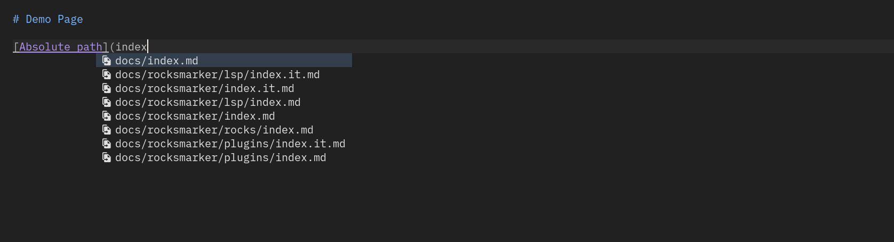
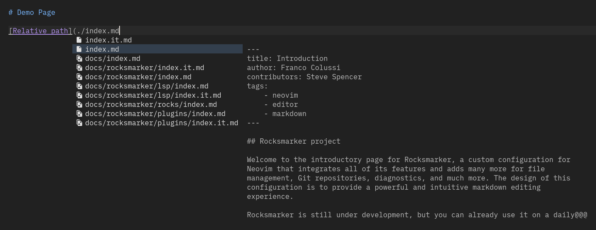
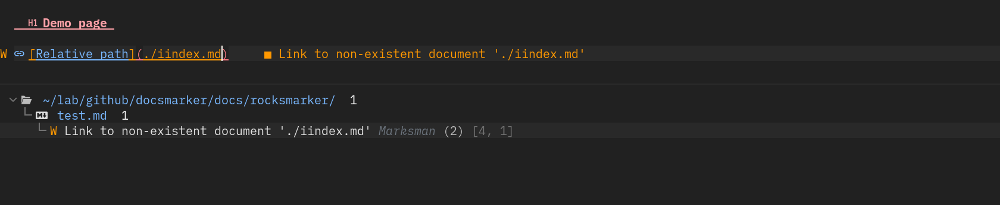
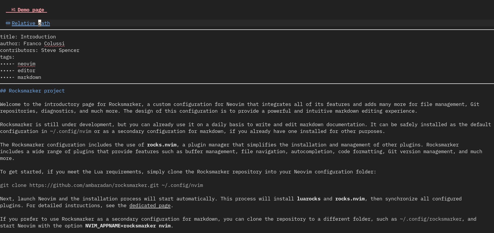
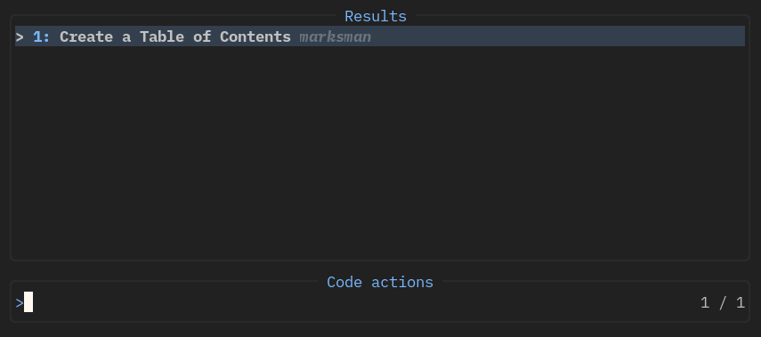
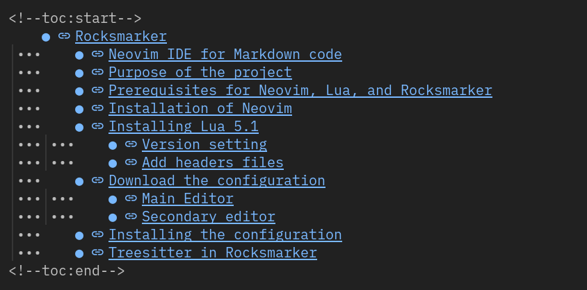
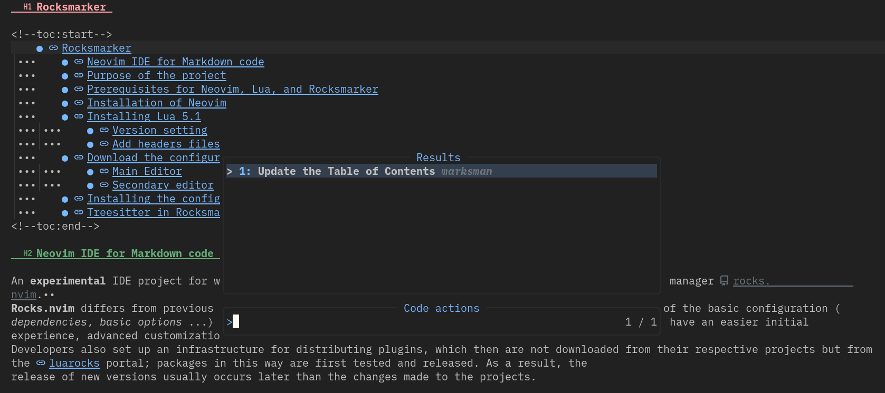

## Introduction

Marksman is a language server that integrates with your editor to help you write and maintain your Markdown documents. Using the LSP protocol, it provides completion, workspace navigation, reference searching, name refactoring, diagnostics, and more.

## Installation

The installation of Marksman happens automatically during the initial setup of Rocksmarker. If it should not, for some reason, be available you can always install it manually with the command:

```txt
:MasonInstall marksman
```

To verify the correct installation of the language server open a markdown file (*.md*) in the editor and type the command `:LspInfo`, it will open a buffer containing the following information. If it is missing, *LspInfo* will not detect any clients attached to the buffer.

```txt
vim.lsp: Active Clients
- marksman (id: 2)
  - Version: ? (no serverInfo.version response)
  - Root directory: ~/lab/github/docsmarker
  - Command: { "marksman", "server" }
  - Settings: {}
  - Attached buffers: 3
```

The LSP message provided by Neovim indicates that the **marksman** client is active and is providing services for files within the `~/lab/github/docsmarker` directory. The client starts with the **marksman server** command and currently has no custom settings. It is working on open file number 3 in the editor.  
The `Root directory` directive is very important as it indicates the directory that marksman uses for diagnostics, write-assisted bindings, and other functionality provided by the server.

This implies that a file contained within the working folder, in this case the `docsmarker` folder, if opened from the folder itself, that marksman will check and supported it at the project level:

```bash
cd ~/lab/github/docsmarker
nvim your_file.md
```

If opened from a location outside the root directory, marksman treats it at the file level, which lacks the project's own functionality (such as preview and link management, reference search, and other features):

```bash
nvim ~/lab/github/docsmarker/your_file.md
```

You can verify the correct implementation of the language server in the status bar that displays the corresponding server name, if attached.


## Marksman features

### Assisted navigation

#### Buffer navigation

Marksman provides some useful shortcuts for navigating markdown buffers. You can move between document headers with the combination of two square brackets. With the combination ++"]]"++ you move to the next header while with the combination ++"[["++ you return to the previous one.

#### Workspace navigation

Using the **go to** function, common to all language servers, one can navigate the internal links in the workspace. If the link is internal to the file, as in the case of a TOC (Table of Contents), by placing the cursor on the link and recalling the key from the keyboard, one is automatically positioned in the corresponding section. If the link is external to the file, it opens in a new buffer.  
The function is available through the key ++space+"g "+"d "++.

### Links

#### Auto completion of links

The language server supports, in assisted writing, auto-completion of links. The feature is very useful as it accelerates document writing and avoids problems arising from incorrectly written paths.

!!! warning "Absolute or relative path"

    Marksman allows the use of both absolute and relative paths for links, but the use of absolute paths must carefully be considered. The markdown code is processed by a *parser* and the relative HTML end code of the link must be checked for correctness.

    #### Use in Rocky Linux Documentation

    The use of absolute links for writing documents for Rocky Linux is discouraged because the project uses MkDocs for transforming markdown code into static HTML code, and the following caveat is included in the related documentation.

    > Using absolute paths with links is not officially supported. Relative paths are adjusted by MkDocs to ensure they are always relative to the page. Absolute paths are not modified at all. This means that your links using absolute paths might work fine in your local environment but they might break once you deploy them to your production server.

#### Link with absolute path

If inserting a link, after entering the link text in the square brackets, when typing the first of the two round brackets, a pop-up will open containing the names of the files in that workspace.  
Selecting the file you want with the ++enter++ key will automatically place it in the round brackets.



#### Link with relative path

You activate link to a relative path in assisted management by typing the starting point `./` that, as with the absolute path, presents a list of the folders and files in the workspace. By hovering over the file you want, it is possible to preview the file you are linking with the ++ctrl+enter++ key.  
This type of linking has the advantage of allowing you to back up from the folder to the location of the file by using the `../` path, allowing multi-folder management of the project.



#### Links verification

Marksman's link management integrates a check for the presence of the corresponding document. This is a great help in managing particularly document-rich projects such as documentation on Rocky Linux.
In this way you can avoid typos or distraction errors that are usually difficult to spot.



!!! tip ""

    The extended display of previous screen errors is provided by the *trouble.nvim* plugin that can be activated with the shortcut ++space+"t"+"b"++

#### Preview of links

For links already in the document, it is possible to preview the contents of the file. This feature is particularly useful when reviewing dated documents where you might not always remember the contents of linked files.  
To activate the preview, place the cursor on the link you want and type ++"K "++ (uppercase). To close it just move the cursor.



!!! note ""

    Link preview is available only for links referring to files in the workspace. No previews are provided for web links and for files outside the *workspace*.

#### Rename and restructure links

The language server also allows for workspace-level renaming of headers present in documents. In renaming, marksman also handles any reference links present, ensuring proper navigation.  
For activation, use the key ++space+"r"+"n"++ keys. Typing it opens the status bar a message ==:New Name== followed by the text of the header where the cursor is. Changing the text, changes the header and all reference links for that header.

!!! info "Rocky Documentation"

    You should avoid reference links in documents written for Rocky Linux documentation. This is because they are not compatible with the development environment used. The multilingual nature of the site and the related processing by the Crowdin translation engine does not allow the translation of these types of links.

### Code Action

A CodeAction represents a change or command that you can perform on the code. For example, to solve a problem or for restructuring. Marksman has a code action for managing TOC (table of contents). To create it, just type the key ++space+"c"+"a"++ and the following pop-up will appear:



Selecting the code action creates the reference link table, which you can then edit and manage with the restructuring function described above (++space+"r"+"n"++).  
An example of this is the TOC of the README of the Rocksmarker project repository:



If the TOC is already present the code action allows you to update it automatically based on changes made to the document:



!!! info "Rocky Documentation"

    This feature, like the one described above, is also not suitable for documents written for documentation on Rocky Linux. Navigation of document references is handled automatically by the *mkdocs-material* plugin in MkDocs making it effectively useless.

## Conclusion

Although not strictly necessary, this language server can become, in time, an excellent companion in writing documentation for Rocky Linux.  
Its use saves time in building page structure and avoids trivial errors such as typos.
