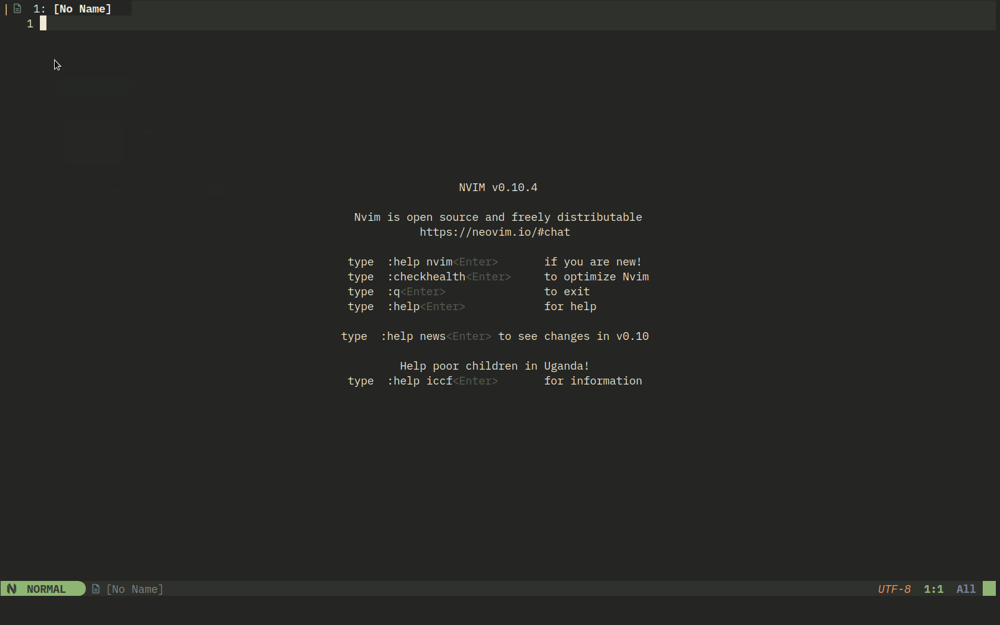

<!--vale off-->

## Neovim IDE for Markdown code

An **experimental** IDE project for writing documentation in Markdown code; the project uses the new plugin manager [rocks.nvim](https://github.com/nvim-neorocks/rocks.nvim).  
**Rocks.nvim** differs from previous plugin managers in its underlying philosophy, which is that writing the basic configuration (*dependencies*, *basic options* ...) is the developer's job and not the user's. This allows the end user to have a simpler initial experience, while advanced plugin customization via configuration files always remains possible.  
Developers have also created an infrastructure for distributing plugins, which are not downloaded from their respective projects, but from the [luarocks](https://luarocks.org/modules/neorocks) portal; this way packages are first tested and then released. As a result, the release of new versions usually occurs later than the changes made to the projects.

## Purpose of the project

To provide as comprehensive an editor as possible for writing Markdown documentation for Rocky Linux; to this end the goals set are:

- Automatic setting of Neovim options for Markdown files
- Highlight Markdown tags in the buffer
- Offer a zen mode for document editing
- Provide custom snippets for writing **mkdocs-material** tags in addition to standard Markdown tags.

### Prerequisites

- A Linux distribution installed and configured as a desktop version. Rocky Linux is used in this guide and consequently should work correctly on all RHEL (Red Hat Enterprise Linux™) derivatives. For installation on other distributions refer to the relevant documentation.
- Proficiency in performing command-line commands
- Ability to run some commands as root user or with administrator permissions.

### Prerequisites for Neovim, Lua and Rocksmarker

The project requires some specific dependencies for its proper execution, in particular, version ==Lua 5.1== is required; versions provided by Rocky Linux are not supported.  
Version 5.1 is necessary for the proper functioning of *rocks.nvim*, which handles plugin management and also ensures full compatibility with the version used by Neovim.

From Neovim docs:

> The Lua 5.1 script engine is builtin and always available.

Some additional packages, such as the *ninja-build* package, provided by the [CRB repository](https://wiki.rockylinux.org/rocky/repo/#notes-on-crb) (CodeReady Linux Builder) are also required. The repository provides common tools for code development and in Rocky Linux can be enabled with the following commands:

```bash
sudo dnf install -y epel-release yum-utils
sudo dnf config-manager --set-enabled crb
```

Once the sources are set up, it is necessary to install some additional packages required for both building *Neovim* and installing the required Lua version; to install them on a Rocky Linux distribution type:

```bash
dnf install npm ncurses readline-devel icu ninja-build cmake gcc make unzip gettext curl glibc-gconv-extra tar git
```

Once the installation is finished, we can move on to building the structure, which involves, as a first step, installing the *Neovim* editor.

## Installation of Neovim

*Neovim* is a modern, powerful and highly customizable text editor that provides a familiar experience for Vim users.  
While maintaining the philosophy of Vim, it simultaneously introduces improvements and features with the goal of providing a similar user experience but on a more modern code base.  
Its improvements include:

- **Improved stability**: The code base has been refactored to improve stability and performance.
- **Improved plugin system**: Neovim enables simplified plugin management by making it easier to extend its functionality.
- **Modern features**: Supports features such as asynchronous operations and better integration with other applications.

!!! note "Compiled version"

    A version ==0.10.0== or higher of Neovim is required for proper execution of Rocksmarker, so using the compiled version is recommended. The version provided by *EPEL* is outdated (0.8.0) and is not compatible with *rocks.nvim* and the plugins used.  
    More information can be found in the instructions in the [Quick Start](https://github.com/neovim/neovim/blob/master/BUILD.md) section of the Neovim website.

Compiling Neovim from source presents no particular problems and, if the above requirements are met, is easy to perform.

### Download the sources

The project is being developed on *GitHub* and to retrieve the sources you need to clone the repository locally. Then take yourself to the chosen location of your file system and download them with:

```bash
git clone https://github.com/neovim/neovim
```

The command creates a `neovim` folder and downloads all the files inside it. When the clone is finished, take yourself to the newly created folder and switch to the ==stable== version with the commands:

```bash
cd neovim/
git checkout stable
```

!!! note ""

    Using the ==git checkout stable== command to place *git* in the stable branch before compilation ensures that the stable (recommended) version is used. If it is omitted, the compilation will be performed with the development branch (currently 0.11).

### Compilation and installation

One command is sufficient for its compilation:

```bash
make CMAKE_BUILD_TYPE=RelWithDebInfo
```

The command calls *make* which takes care of the entire process to which the **CMAKE_BUILD_TYPE** flag is passed that specifies the type of compilation.  
In particular, the **RelwithDebInfo** compilation produces fully optimized code, but it also builds the program database and inserts debug line information useful for any editor errors.

After the compilation is finished, it is possible to verify the correct execution of the new build even without installing it. Neovim does not require external components to run, and consequently it is sufficient to call up the newly compiled executable to thoroughly test the new version of the editor before replacing the version being used.

```bash
./neovim/build/bin/nvim
```

Its installation, once verified to be working properly, is always performed by *make*. The files, as with Lua installation, are copied to `/usr/local` and again the command must be run as a *root* user or with administrator permissions.

```bash
sudo make install
```

The installation makes available in the system the new command ==nvim== for opening the editor in the terminal, which can also be used to check the installed version:

```bash
nvim --version
NVIM v0.10.4
Build type: RelWithDebInfo
LuaJIT 2.1.1713484068
Run "nvim -V1 -v" for more info
```

!!! tip "Removing Neovim"

    For its removal, a CMake target is provided that removes all files installed by ==make install==

    ```bash
    sudo cmake --build build/ --target uninstall
    ```

    It is therefore advisable to keep the folder with the sources for eventual removal.

Now that the editor is ready to use you can move on to installing the version of *Lua* corresponding to the one provided by *Neovim*.

## Installing Lua 5.1
  
The plugin manager chosen to configure additional Neovim plugins (**rocks.nvim**), requires that the *Lua 5.1* version be installed in order to function properly and that it be the default version for that user space. It also requires that version 5.1 *headers* files be linked to those on the system.  

!!! note "Coexistence of multiple versions"

    One of the features of Lua, resulting from its development as an "embedded" language, is that it does not require external dependencies. As a result, different versions can coexist on the same system without conflicting.  
    For example, a desktop installation of Rocky Linux 9 provides version 5.4.4, which is used by the various applications that require it even though the default version is 5.1.

### Download the required version

Version 5.1 is available on the official Lua website on the [download](https://www.lua.org/download.html) page, the latest updated version is ==5.1.5== which can be downloaded with the command:

```bash
curl -O https://www.lua.org/ftp/lua-5.1.5.tar.gz
```

Once downloaded verify the integrity of the downloaded package with the *sha256* utility by comparing the result of the following command with the *checksum* provided by the download site:

```bash
sha256sum lua-5.1.5.tar.gz 
2640fc56a795f29d28ef15e13c34a47e223960b0240e8cb0a82d9b0738695333  lua-5.1.5.tar.gz
```

Verified the integrity of the download unpack the compressed archive and place inside it:

```bash
tar xzf lua-5.1.5.tar.gz
cd lua-5.1.5
```

### Compilation and installation

Its installation is a system installation (in `/usr/local/`), this is to allow simplified subsequent configuration of *headers* files, administrator permissions are consequently needed at this stage.

For proper compilation you need the additional *readline-devel* package available in the official Rocky Linux repositories. The package should already be available if the packages mentioned in the prerequisites above have been installed.

!!! note ""

    The package takes on this name in distributions derived from RHEL, but in others it is identified differently. Debian, for example, identifies it as *libreadline-dev*.

Build the version with:

```bash
make linux test
```

The command performs a requirements check and proceeds to compile the binaries. If everything finishes without errors, the following message is printed to the terminal:

> Hello world, from Lua 5.1!

The *make* system utility is used to install it; the command must be run as a *root* user or with administrator privileges:

```bash
sudo make install
```

The installation copies the 5.1.5 version files to the `/usr/local/` path, thus keeping them separate from the system version files installed by default in `/usr/`.  
The following files are installed:

- **lua** - **luac** -> `/usr/local/bin/`
- **lua.h** - **luaconf.h** - **lualib.h** - **lauxlib.h** - **lua.hpp** -> `/usr/local/include/`
- **liblua.a** -> `/usr/local/lib/`

!!! tip ""

    The compilation does not provide a utility for removal of the installation. Removal can be done manually by deleting the files listed above.

### Version setting

If your system is a desktop version, a default version of Lua is most likely already installed. However, it is unlikely that this version matches the one you require, so you need to set the default version to point to the correct version.

!!! note "Preinstalled version"

    The version installed on the system will surely be later than 5.1, but in this regard it should be pointed out that versions after 5.1 are not considered stable as they are not compatible with each other.  
    To check the installed version, type:

    ```bash
    lua -v
    Lua 5.4.4  Copyright (C) 1994-2022 Lua.org, PUC-Rio
    ```

The entire project is based on the stable version of Lua used by both Neovim and rocks.nvim, and it is imperative that the default version for the user profile is 5.1.  
To meet this requirement add an *alias* in *.bashrc* to tell the system which version to use as the default for that user space.
Open your `.bashrc` in an editor and add the following string:

```bash
alias lua=/usr/local/bin/lua
```

Save the file and run the *source* to reread the configuration with:

```bash
. ~/.bashrc
```

Once you re-read the file verify the version change with:

```bash
lua -v
Lua 5.1.5  Copyright (C) 1994-2012 Lua.org, PUC-Rio
```

Now every time the executable is requested, the requested version will be used instead of the system version.

### Add header files

Installing the required version is not sufficient for the configuration to work properly. The *rocks.nvim* plugin manager needs Lua's *headers* files to compile its version of *luarocks*.  
You must then link the required library, **lua.h**, found in `/usr/local/include/` in the *headers* file search path (`/usr/include/`).

!!! warning ""

    The lack of this file does not allow the initialization script to compile *luarocks* which ends with an error aborting the entire process.

For its linking we use one of the standard *luarocks* `/usr/include/lua/<number_version>` search paths linked to the folder with version 5.1 *headers* files in `/usr/local/include/`.

For its implementation, it is again necessary to operate as root user or with administrator permissions. Then take yourself to the `include` folder:

```bash
cd /usr/include/
```

Create the `lua` folder and place yourself inside it; the `/usr/include/lua/` folder is not present on a Rocky Linux system, so you must create it.

```bash
sudo mkdir lua && cd lua
```

Then create the symbolic link to the `/usr/local/include/` folder.

```bash
sudo ln -s /usr/local/include/ 5.1
```

The command links the folder where the *headers* files were copied during the installation of Lua 5.1 to a folder named `5.1` created by the command itself.  
The folder naming is arbitrary but choosing to use the version number allows mnemonic recall to its contents and more importantly meets the requirements for *luarocks* path finding.

For its verification just list the `5.1` folder and the files contained in `/usr/local/include/` should appear:

```bash
ls -l /usr/include/lua/5.1/
total 52
-rw-r--r--. 1 root root  5777 27 dic  2007 lauxlib.h
-rw-r--r--. 1 root root 22299 11 feb  2008 luaconf.h
-rw-r--r--. 1 root root 11688 13 gen  2012 lua.h
-rw-r--r--. 1 root root   191 23 dic  2004 lua.hpp
-rw-r--r--. 1 root root  1026 27 dic  2007 lualib.h
```

With this last step, the installation environment is complete, all the necessary requirements are met, and you can move on to installing the editor.

## Download the configuration

The configuration, although still under development, can be used daily to write and edit documentation written in Markdown, so it can be installed as the default configuration in the `.config/nvim` path.  
For users who already have a Neovim configuration on their system, there is the option of using *Rocksmarker* as a secondary editor, thus allowing them to continue using their existing configuration to develop their projects.  
This method also allows you to try *Rocksmarker*, completely independently, to evaluate whether it can be a useful tool for your daily work.

### Main editor

To install the configuration in the default Neovim location, clone the GitHub repository to the configurations folder `~/.config/` with the command:

```bash
git clone https://github.com/ambaradan/rocksmarker.git ~/.config/nvim
```

Once finished, simply invoke the standard Neovim command to start the installation:

```bash
nvim
```

### Secondary editor

To test or use the configuration as a secondary configuration, use Neovim's variable *NVIM_APPNAME*; use of this variable allows Neovim to pass an arbitrary name that is used for searching the configuration files in `~/.config/` and for the subsequent creation of the shared file folder in `~/.local/share/` and the cache in `~/.cache/`.  
To set *Rocksmarker* as a secondary editor:

```bash
git clone https://github.com/ambaradan/rocksmarker.git ~/.config/rocksmarker/
```

Once the clone is complete, start Neovim with the following command to begin the installation:

```bash
NVIM_APPNAME=rocksmarker nvim
```

!!! warning "Subsequent starts"

    If you choose this method, all subsequent starts of the configuration must be done with the command described above, otherwise Neovim will start using the default `~/.config/nvim` folder. To avoid typing the entire command each time, we recommend creating an *alias*.

    ```bash
    alias rocksmarker="NVIM_APPNAME=rocksmarker nvim"
    ```

## Installing the configuration

When Neovim is started with either of the two methods described above, it will begin the installation process managed by a *bootstrap* script that checked for the lack of the *rocks.nvim* plugin and proceeded to install it.  
The process first installs *luarocks* required as a dependency of the plugin and then the plugin itself, at the end of which if everything worked correctly, you will be asked to press ENTER to continue.

```text title="rocks.nvim bootstrap"
Downloading luarocks...
Configuring luarocks...                                                                                                            
Installing luarocks...                                                                                                             
Installing rocks.nvim...                                                                                                           
rocks.nvim installed successfully!                                                                                                 
Press ENTER or type command to continue 
```

The second step is to synchronize all configured plugins; synchronization installs the plugins in the shared files folder in the path `.local/share/nvim/rocks/lib/luarocks/rocks-5.1/`.  
Responding with ++"Y"++ will begin the installation process of all configured plugins.

```text title="plugins sync"
rocks.nvim: The following plugins were not found:                                                                                    
trouble.nvim, mason.nvim, mason-lspconfig.nvim, nvim-lspconfig, nvim-cmp,
mason-tool-installer.nvim, luasnip, markdown.nvim, markview.nvim,
markdown-table-mode.nvim, zen-mode.nvim, conform.nvim, nvim-cokeline,
gitsigns.nvim, bamboo.nvim, telescope.nvim, persisted.nvim, toggleterm.nvim,
neo-tree.nvim, neogit, nvim-spectre, indent-blankline.nvim, nvim-autopairs,
nvim-highlight-colors, yanky.nvim, cmp-buffer, cmp-nvim-lsp, cmp-path,
cmp_luasnip, diffview.nvim, friendly-snippets, rocks-treesitter.nvim,
telescope-cmdline.nvim, telescope-file-browser.nvim, telescope-frecency.nvim,
telescope-ui-select.nvim, tree-sitter-bash, rainbow-delimiters.nvim,
tree-sitter-cli, rocks-config.nvim, tree-sitter-css, rocks-edit.nvim,
tree-sitter-git_config, tree-sitter-git_rebase, tree-sitter-gitattributes,
tree-sitter-gitcommit, tree-sitter-gitignore, tree-sitter-html, tree-sitter-ini,
tree-sitter-json, tree-sitter-jsonc, tree-sitter-lua, tree-sitter-luadoc,
tree-sitter-markdown, tree-sitter-markdown_inline, tree-sitter-toml,
tree-sitter-vim, tree-sitter-vimdoc, tree-sitter-yaml, which-key.nvim,
fidget.nvim, feline.nvim, nvim-lint, rocks-lazy.nvim, rocks-git.nvim,
nvim-web-devicons.                  
                                                                                                                                     
Run 'Rocks sync'?                                                                                                                    
[Y]es, (N)o:  
```

Once the installation of the plugins is finished close the editor and reopen it to give Neovim a chance to load the new configurations, on the second startup also the *mason-lspconfig* and *mason-tool-installer* plugins install, fully automatically, the *language servers* (LSP), *linters* and *formatters* necessary for the correct functioning of the editor, once the installation of the language servers is finished the editor is ready to be used.



## Conclusions

Rocksmarker is a custom configuration of Neovim and integrates all of its features; it also provides a number of additional features for file management, git repositories, diagnostics, and more.  
An overview of the shortcuts that activate the functions can be found in the `/lua/mappings.lua` file.  
Alternatively, the ++space++ key activates the command menu in the lower right corner where all available commands are listed. Letters marked with a **+** provide additional selections; selecting the corresponding letter switches to the context menu and returns to the main menu with ++back++ while ++"'"++ calls up the menu for buffer navigation.


