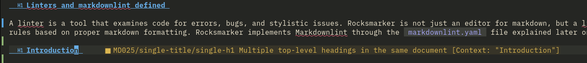

## Linters and markdownlint defined

A linter is a tool that examines code for errors, bugs, and stylistic issues. Rocksmarker is not just an editor for markdown, but a linter as well. It uses a variety of tools as its linting mechanism. Markdownlint is a project dedicated to providing rules based on proper markdown formatting. Rocksmarker implements Markdownlint through the `.markdownlint.yaml` file explained later on.

## Introduction

Neovim is a great editor, but the real power of the project comes from the wealth of plugins and additions that makes it possible to mold the editor into what works best for you. This is why Rocksmarker makes such a good editor for markdown, because the author of the project focuses on this goal. The markdownlint rules are just one of these tools. For someone with a little `vim` or Neovim experience already, Rocksmarker makes it possible to start creating or editing markdown code as soon as installation completes. Even without this experience, it takes a minimal length of time to get the basics down. With Markdownlint, the user is free of debugging document formatting on their own.

## The `.markdownlint.yaml` file

Rocksmarker includes the rules file for linting, `.markdownlint.yaml`, in the root of the project. You can find this file in other projects too, although the rules in it might be different. The Rocky Linux documentation includes a `.markdownlint.yaml` file with contents very similar to Rocksmarker. The rules in use at the time of this writing are from the latest version (v0.37.4) of [David Anson's rule set](https://github.com/DavidAnson/markdownlint).

### Rules explanation

Rocksmarker keeps the defaults for most of the rules in the `.markdownlint.yaml`. There are a few exceptions.

| Rule  | Explanation                                                                      | Value                           |
|-------|----------------------------------------------------------------------------------|---------------------------------|
| MD001 | Enforces heading incrementing. Skipping from h1 to h3 is not allowed.            | default                         |
| MD003 | Enforces heading style. Rocky Linux only supports ATX style headings anyway.     | default                         |
| MD004 | Unordered list style must be consistent. (use only - or * but not both)          | default                         |
| MD005 | Inconsistent list item indentation. Enforces proper indentation of all lists.    | default                         |
| MD007 | Unordered list indentation. Spaces for indentation.                              | spaces for indent modified to 4 |
| MD009 | Trailing spaces. Sets the allowed value for trailing spaces.                     | default                         |
| MD010 | Enforces no hard tabs or white space. Ensures spaces only for indentation.       | default                         |
| MD011 | Enforces the proper formatting of links.                                         | default                         |
| MD012 | Only allow a single blank line between elements.                                 | default                         |
| MD013 | Line length rules.                                                               | disabled                        |
| MD014 | No preceding $ in code with no output displayed.                                 | default                         |
| MD018 | Enforces the space after the hash on an ATX heading.                             | default                         |
| MD019 | Enforces only one space after the hash on an ATX heading.                        | default                         |
| MD020 | Enforces spaces after closed ATX heading before the hash. Not used.              | default                         |
| MD021 | For closed ATX headings. Not used.                                               | default                         |
| MD022 | Enforces surrounding headings with a blank lines.                                | default                         |
| MD023 | Enforces headings starting at the beginning of a line. (no indentation)          | default                         |
| MD024 | No duplicate headings.                                                           | default                         |
| MD025 | Enforces only one top level heading (h1) in a document.                          | default                         |
| MD026 | No trailing punctuation in heading.                                              | default                         |
| MD027 | Enforces only a single space after the block quote symbol (`>`).                 | default                         |
| MD028 | No blank lines inside of a block quote.                                          | default                         |
| MD029 | Ordered list prefix.                                                             | default                         |
| MD030 | Enforces single space after list markers.                                        | default                         |
| MD031 | Enforces blank lines around code blocks.                                         | default                         |
| MD032 | Enforces a blank line around lists of any kind.                                  | default                         |
| MD033 | No inline HTML. Rocky Linux shows errors when using HTML elements.               | default                         |
| MD034 | No bare URL. To use a URL outside of a link, you must surround it with (`<>`)    | default                         |
| MD035 | Horizontal rule style must be consistent.                                        | default                         |
| MD036 | Do not use emphasis to replace a heading with (`**my text**`)                    | default                         |
| MD037 | No space in emphasis. When using bold or italic format without spaces (`*this*`) | default                         |
| MD038 | No spaces in code (single backtick without spaces)                               | default                         |
| MD039 | No spaces inside link text.                                                      | default                         |
| MD040 | Fenced code blocks should have a specified language (bash, text, markdown, etc.) | default                         |
| MD041 | First line in file should be a top level heading.                                | default                         |
| MD042 | No empty links.                                                                  | default                         |
| MD043 | Required heading structure. Not applicable.                                      | default                         |
| MD044 | Proper name capitalization. (handled by `vale` in this case, so ignored.)        | default                         |
| MD045 | All images should have alternate text.                                           | default                         |
| MD046 | Consistent code blocks. Rocky Linux uses fenced code blocks.                     | default                         |
| MD047 | Files should end with a single newline character.                                | default                         |
| MD048 | Use consistent fenced code block style.                                          | default                         |
| MD049 | Use consistent emphasis style. (italic)                                          | default                         |
| MD050 | Use consistent emphasis style. (bold)                                            | default                         |
| MD051 | Links within document. Not applicable. Do not use links within documents.        | default                         |
| MD052 | Pertains to reference links and labels. Not applicable to Rocky Linux.           | default                         |
| MD053 | Needs link and reference definitions.                                            | default                         |
| MD054 | Link and image style. Defined by material-mkdocs within Rocky Linux. Ignored.    | default                         |
| MD055 | Use consistent table style. Forced within material-mkdocs. Ignored.              | default                         |
| MD056 | Table column count must match.                                                   | default                         |
| MD058 | Enforces blank lines around tables.                                              | default                         |

The modification of indentation spaces with rule **MD007** is for proper indenting within admonitions. Rocky Linux documentation does not require line-length rules (**MD013**).

When you trip a markdownlint rule, you will receive an error with the rule number:



## Integration into the editor

The editor uses the *Markdownlint* rules for the error reporting function in the *nvim-lint* plugin configuration, and for formatting code in *conform.nvim*.  
The combination of the two controls minimizes the need for correcting errors. The formatter corrects automatically remediable errors at each save, while the linter signals those that need manual intervention for their correction.

### Formatter

As mentioned earlier the *conform.nvim* plugin provides code formatting, its setting is by file type (==formatters_by_ft==) and as you can see from the code below it provides support for many programming languages.  
The editor runs this function on each buffer save (==format_on_save==) and when called, uses the rules provided by *markdownlint*.  
In this way, all detected but recoverable errors are automatically corrected without the need for manual intervention.

```lua title="/lua/plugins/diagnostic.lua" linenums="2" hl_lines="2 8 12"
require("conform").setup({
 formatters_by_ft = {
  lua = { "stylua" },
  css = { "prettier" },
  html = { "prettier" },
  sh = { "shfmt" },
  bash = { "shfmt" },
  markdown = { "markdownlint" },
  yaml = { "yamlfmt" },
 },

 format_on_save = {
  -- These options will be passed to conform.format()
  timeout_ms = 1000,
  lsp_format = "fallback",
 },
})
```

#### Manual formatting

To have full control over buffer markdown errors, you can set up manual formatting. To do this, just comment out the part about **format_on_save** and restart the editor.

```lua title="codice da formattare" linenums="13"
 --format_on_save = {
  -- These options will be passed to conform.format()
  --timeout_ms = 1000,
  --lsp_format = "fallback",
 --},
```

The editor in this configuration will flag all markdown errors in the buffer without applying any corrections; this can be didactically interesting for learning the rules and correcting one's writing.  
Errors will be present even after saving the buffer, making it possible to study them and change them to be manually verified.

!!! tip ""

    Automatic formatting is still available. You can apply it with the shortcut ++space+"F"++. The key invokes the same function used for formatting by ==format_on_save==.

    ```lua title="/lua/mappings.lua" linenums="70"
    {
    "<leader>F",
     function()
      require("conform").format({ lsp_fallback = true })
     end,
    desc = "format buffer",
    mode = "n",
    },
    ```

### Linter

The *nvim-lint* plugin provides the linting function, and is an extremely efficient asynchronous linter that complements the support provided by the Neovim language protocol. You can configure it to control a large number of programming languages. You can find a list of the available languages in the [related section](https://github.com/mfussenegger/nvim-lint?tab=readme-ov-file#available-linters) of the project.  
An auto-command invokes this functionality, triggered by the **BufWritePost** event, an event that occurs each time you write the buffer to the hard disk. The definition of code verification comes by way of the file type (==linters_by_ft==), and in the case of markdown documents, verifies both code correctness with *markdownlint*, and content correctness with *vale*.

```lua title="/lua/plugins/diagnostic.lua" linenums="23" hl_lines="2 7"
require("lint").linters_by_ft = {
 markdown = { "markdownlint", "vale" },
 yaml = { "yamllint" },
 bash = { "shellcheck" },
}

vim.api.nvim_create_autocmd({ "BufWritePost" }, {
 callback = function()
  require("lint").try_lint()
 end,
})
```

## Conclusions

Markdownlint is powerful tool. It is well integrated into the framework of Rocksmarker, and includes the ability to customize any rule in the `.markdownlint.yaml` file. In addition, further customizations described in the configuration of Rocksmarker in this document, make this feature flexible, similar to the remaining aspects of Rocksmarker and Neovim. The inclusion of Markdownlint helps you minimize errors that you might otherwise inject into your markdown code.
