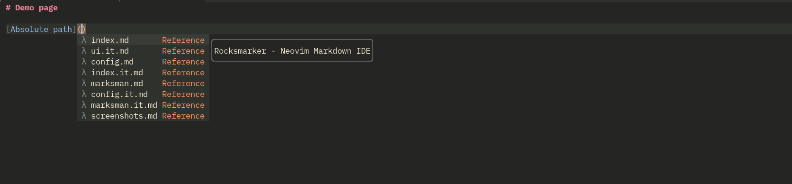
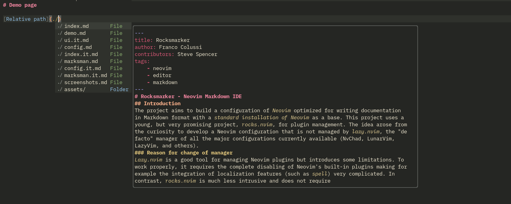
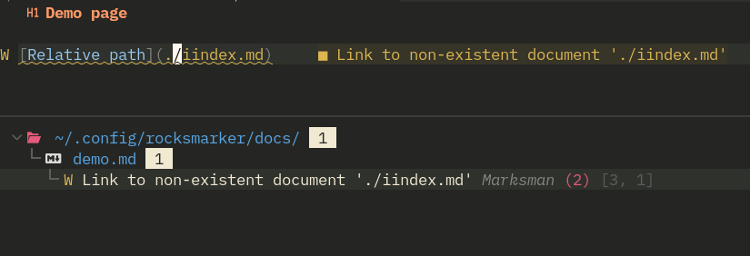
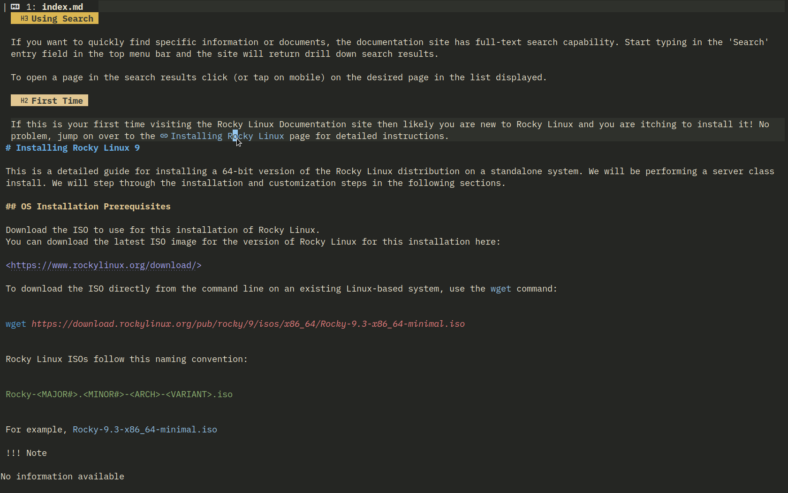
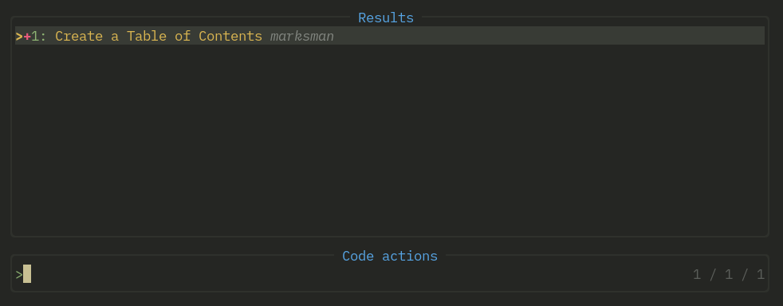
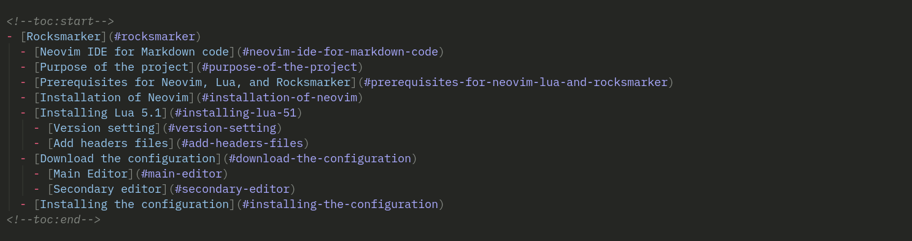
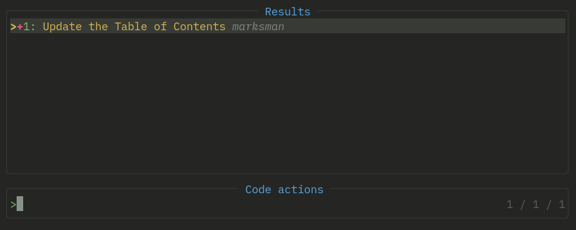

# Marksman

## Introduction

Marksman is a language server that integrates with your editor to help you write and maintain your Markdown documents. Using the LSP protocol, it provides completion, workbook navigation, reference searching, name refactoring, diagnostics, and more.

## Installation

Marksman is installed automatically during the initial setup of Rocksmarker. If it should not, for some reason, be available it can always be installed manually with the command:

```txt
:MasonInstall marksman
```

To verify the correct installation of the language server open a markdown file (*.md*) in the editor and type the command `:LspInfo`, it will open a floating buffer containing the information described below, in case it is missing LspInfo will not detect any clients attached to the buffer.

```txt
 Language client log: /home/your_user/.local/state/nvim/lsp.log
 Detected filetype:   markdown
 
 1 client(s) attached to this buffer: 
 
 Client: marksman (id: 1, bufnr: [1, 14])
  filetypes:       markdown, markdown.mdx
  autostart:       true
  root directory:  /home/your_user/your_dir
  cmd:             /home/your_user/.local/share/nvim/mason/bin/marksman server
```

The message, as you can see, says that a markdown file has been detected in the buffer and that there is an attacked client (marksman).
The characteristics of the supported file types are described and that the server is started automatically upon detection of those file types, then follows an indication of the working directory and the command used for language support.  
The `root directory` directive is very important as it indicates the directory that marksman uses for diagnostics, write-assisted linking, and other functionality provided by the server.

This implies that a file contained within the working folder, in this case the `your_dir` folder, if opened from the folder itself is checked and supported by marksman at the project level:

```bash
cd /path_to/your_dir
nvim your_file.md
```

Whereas if opened from a location outside the root directory it is treated by marksman at the file level with the lack of the project's own functionality (such as preview and link management, reference search, and other features):

```bash
nvim ~/path_to/your_dir/your_file.md
```

The correct implementation of the language server can also be verified in the status bar where the corresponding server name is displayed, if attached.


## Marksman features

### Assisted navigation

#### Buffer navigation

Marksman provides some useful shortcuts for navigating markdown buffers; you can move between document headers with the combination of two square brackets. With the combination ++"]]"++ you move to the next header while with the combination ++"[["++ you return to the previous one.

#### Workspace navigation

Instead, using the **go to** function, common to all language servers, one can navigate the internal links in the workspace, if the link is internal to the file, as in the case of a TOC (Table of Contents), by positioning oneself on the link and recalling the key from the keyboard one is automatically positioned in the corresponding section if, on the other hand, the link is external to the file it is opened in a new buffer.  
The function is available through the key ++space+"g"+"d"++.

### Links

#### Auto completion of links

The language server supports, in assisted writing, auto completion of links. The feature is very useful as it speeds up document writing and avoids problems arising from incorrectly written paths.

!!! warning "Absolute or relative path"

    Marksman allows both absolute and relative paths to be used for links, but the use of absolute paths should be carefully evaluated. The markdown code is processed by a *parser* and the relative HTML end code of the link must be checked for correctness.

    #### Use in Rocky Linux Documentation

    The use of absolute links for writing documents for Rocky Linux is discouraged because the project uses MkDocs for transforming markdown code into static HTML code, and the following caveat is included in the related documentation.

    > Using absolute paths with links is not officially supported. Relative paths are adjusted by MkDocs to ensure they are always relative to the page. Absolute paths are not modified at all. This means that your links using absolute paths might work fine in your local environment but they might break once you deploy them to your production server.

#### Link with absolute path

When typing a link after entering the text of the link in the square brackets upon typing the two round brackets a pop-up will open containing the names of the files in that work area which if selected will provide additional information about the title of the file.  
Selecting the desired file with the ENTER key will automatically place it in the round brackets.



#### Link with relative path

Linking to a relative path in assisted management is instead activated by typing the starting point `./` which, as with the absolute path, presents a list of the folders and files in the workspace. In this case, however, the name of the file to be linked is preceded by its position relative to the folder where the file is located, and its selection offers a preview of the document being linked, thus facilitating the work.  
This type of link also has the advantage of allowing in the linking to go back up from the folder where the file is located using the `../` path, thus allowing multi-folder management of the project.



#### Checking links

Marksman also integrates in its link management a check for the presence of the corresponding document. This is a great help in managing particularly document-rich projects such as documentation on Rocky Linux.
It allows you to avoid typos or distraction errors that are usually difficult to spot.



!!! tip ""

    The extended display of previous screen errors is provided by the *trouble.nvim* plugin that can be activated with the shortcut ++space+"t"+"b"++

#### Preview of links

For links already in the document, it is possible to preview the contents of the file. This feature is particularly useful when reviewing dated documents where you may not always remember the contents of linked files.  
To activate the preview place the cursor on the desired link and type ++"K "++ (uppercase), to close it simply move the cursor.



!!! note ""

    Link preview is available only for links referring to files in the work area; no previews are provided for web links and for files outside the *workspace*.

#### Rename and restructure links

The language server also allows for workspace-level renaming of headers present in documents, in renaming marksman also handles any reference links present thus ensuring proper navigation.  
For its activation the key ++space+"r"+"n"++ is provided, typing it opens in the status bar a message ==:New Name== followed by the text of the header where the cursor is located, changing the text changes the header and all reference links for that header.

!!! info "Rocky Documentation"

    Reference links in documents written for Rocky Linux documentation should be avoided, this is because they are not compatible with the development environment used. The multilingual nature of the site and the related processing by the Crowdin translation engine does not allow the translation of these types of links.

### Code Action

A CodeAction represents a change or command that can be executed on the code, for example, to solve a problem or to restructure it. Marksman has a code action for managing TOC (table of contents), to create it simply place the cursor at the desired location and type the key ++space+"c "+"a "++ and the following pop-up will appear:



Selecting the code action creates the reference link table, which can then be edited and managed with the restructuring function described above (++space+"r "+"n "++).  
Un esempio di quanto descritto è il TOC del README del repository del progetto Rocksmarker:



If the TOC is already present the code action allows it to be updated automatically based on changes made to the document:



!!! info "Rocky Documentation"

    This feature like the one described above is also not suitable for documents written for documentation on Rocky Linux. Navigation of document references is handled automatically by the *mkdocs-material* plugin in MkDocs making it effectively useless.

## Conclusion

Although not strictly necessary, this language server can become, in time, an excellent companion in writing documentation for Rocky Linux.  
Its use saves time in building page structure and avoids trivial errors such as incorrect typing.
