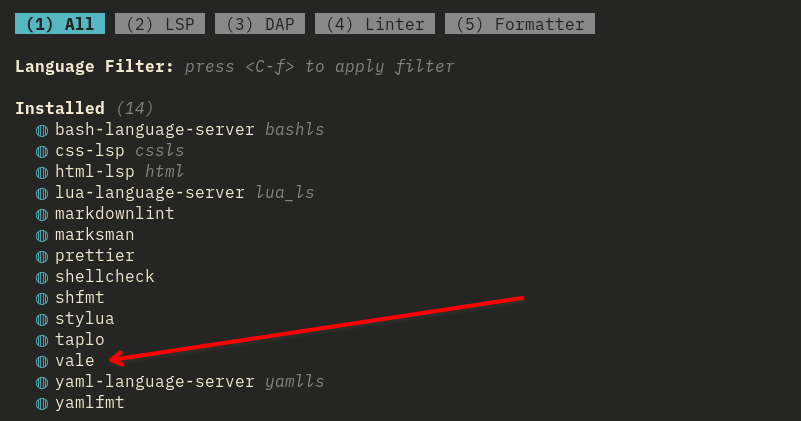

## Introduction

[Vale](https://vale.sh/) is an open source utility with the goal of improving voice, tone, and style consistency. It works as a command-line utility in most editors. Rocksmarker integrates Vale by default. You can see this by running `:Mason` after the Rocksmarker installation:



When you save a document in Rocksmarker, it will automatically show results where necessary if you are using Vale.

## Rocksmarker without Vale

It is possible to run Rocksmarker without Vale, but you will miss out on many great features that will improve your writing. If you do not care about Vale and want to run Rocksmarker without it, you must create an empty `.vale.ini` file in your home directory:

```bash
touch ~/.vale.ini
```

Rocksmarker will now work without any further configuration of Vale.

## Rocksmarker with Vale

In your home directory, create a `.vale.ini` with some content. An example configuration is:

```ini
StylesPath = ~/.local/share/nvim/vale-styles 

Vocab = terminology, brands, software, neovim 

MinAlertLevel = suggestion

Packages = RedHat, alex

[*]
BasedOnStyles = Vale, RedHat, alex
```

## `.vale.ini` explained

### `StylesPath` and `Vocab` sections

`StylesPath` specifies where Vale should look for its external resources. These includes resources from the packages in the "Packages" section (in this case RedHat and alex), and a `config` directory containing a `vocabularies` subdirectory (optional). You can have any number of subdirectories under the `vocabularies` subdirectory, but Vale uses only those specified by the "Vocab" section. Here is a tree view of the author's `vocabularies` subdirectory:

```text
.
└── vocabularies
    ├── brands
    │   ├── accept.txt
    │   └── reject.txt
    ├── neovim
    │   ├── accept.txt
    │   └── reject.txt
    ├── rockydocs
    │   ├── accept.txt
    │   └── reject.txt
    ├── software
    │   ├── accept.txt
    │   └── reject.txt
    └── terminology
        ├── accept.txt
        └── reject.txt
```

Note that there is a 5th vocabulary subdirectory not mentioned in the "Vocab" section (`rockydocs`). This means that this vocabulary might exist, but is not in use. Each vocabulary directory has two files, an `accept.txt` file and a `reject.txt` file. The `reject.txt` file must exist, but can be (and often is) empty. The `accept.txt` has acceptable vocabulary words. As an example, here is part of the author's `accept.txt` in the `software` subdirectory:

```text
AWX
[Aa]nsible
[Aa]nsistrano
anacron
(?i)Apache
[Bb]ash
[Cc]addy
cerbot
Chyrp
cmake
...
```

There are a few things to note here. First, Vale looks not just at the spelling, but the case of the word. If you want to accept both upper and lower-case, you can either use the upper and lower-case letters within `[]` or use the ignore case `(?i)`. If a word is only capitalized, then that is the only acceptable use of the word. Same goes for lower-case.

You can build your own vocabulary sections, use only the built-in vocabularies provided by your "Packages" section, or install vocabularies from third-parties such as [this one from the creator of Rocksmarker](https://github.com/ambaradan/vale-at-rocky).

### `MinAlertLevel`

As the title suggest, Vale will report errors based on the `MinAlertLevel` set. There are three levels:

* suggestion (default) - allows the continuation of editing with suggestions
* warning - allows the continuation of editing with a warning
* error - you must fix problems before continuing to edit

In most cases, "suggestion" is a good editor default. You can find [more information about `MinAlertLevel` from the Vale project page](https://vale.sh/docs/keys/minalertlevel)

### `Packages` section

There are many packages that are available, but not all are open source or free to use. For this project, we have chosen two open source packages, "RedHat" and "alex."

The "RedHat" package has the bulk of the technical terminology we use within Rocky Linux, while the "alex" package has words and phrases that might be offensive. Both packages are very helpful when running Vale.

For further information about the [Packages section, see the Vale project page](https://vale.sh/docs/keys/packages).

### The `[*]` and `BasedOnStyles` sections

These two options go together. The `[*]` is a glob pattern that says to match everything within the `BasedOnStyles` section. As an example, if you want to only match `.txt` or `.md` files, you would replace the glob pattern `[*]` with `[*.{md,txt}]`. For our purposes the `[*]` glob pattern works well.

The `BasedOnStyles` section specifies the styles that will have all of their rules in use.

## Making the `vale` binary run from your home directory

When you install Rocksmarker, the `vale` binary will not be in your PATH. While Rocksmarker will run Vale regardless, you want to be able to initialize your packages and styles without remembering the path to the binary. After installation, the path to the `vale` binary is in `~/.local/share/nvim/mason/bin/vale`. To add an alias to your `.bashrc` file so that you can run `vale` from your home directory, do:

```bash
echo alias vale=~/.local/share/nvim/mason/bin/vale >> .bashrc
```

The double `>>` are very important in that last command. They append that alias to the end of the `.bashrc` file.

Once you run that command, run `bash` to "read" the new `.bashrc` in:

```bash
bash
```

## Initializing Vale with `vale sync`

Before we use Rocksmarker with Vale, it needs initialization so that the our packages install, and Vale is aware of our `StylesPath`.

Creating the alias in the earlier procedure simplifies this. Since you can run `vale` from your home directory, you can run `vale sync` as well. Running `vale sync` periodically is a good idea to update any package vocabulary or rule changes.

The results of running `vale sync` will be:

```bash
Syncing alex [2/2] ███████████████████████████████████████████████████ 100% | 1s
SUCCESS  Synced 2 package(s) to '~/.local/share/nvim/vale-styles'
```

## Conclusion

Rocksmarker includes Vale and is not complex to set up and use. The benefits it brings to your writing will improve your voice, tone, and style consistency.
